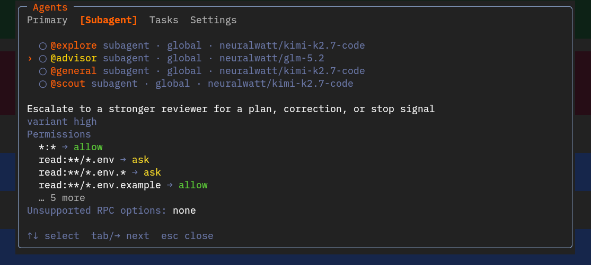

# pi-landstrip



`pi-landstrip` adds sandboxed Bash, primary agents, and sandboxed subagents to
[Pi](https://pi.dev/). OS isolation is provided by
[`landstrip`](https://github.com/landstrip/landstrip).

The package includes a default [sandbox policy](./sandbox.json). Configure agents,
subagent limits, permissions, and OpenCode imports under `landstrip` in Pi
`settings.json`. Trusted project settings override global settings.

Process-backed subagents require Pi >= 0.82.0, and Node.js >= 22.19.0.

## Installation

### Automatic install

```sh
pi install npm:pi-landstrip
```

This installs `pi-landstrip` and its `@landstrip/landstrip` dependency. Native
binaries are published for Linux, macOS, and Windows on x64 and Arm64.

### Manual install

Add the extension to `~/.pi/agent/settings.json` (global) or
`.pi/settings.json` (project):

```json
{
  "packages": ["npm:pi-landstrip"]
}
```

Alternatively, place the extension under `~/.pi/agent/extensions/` (global) or
`.pi/extensions/` (project). See Pi's
[extension documentation](https://pi.dev/docs/latest/extensions) for details.

On unsupported platforms the extension loads but leaves sandboxing disabled.

Pi's Git Bash/MSYS shell cannot start in LPAC, so the default Windows policy uses
standard AppContainer. `/sandbox` and the status line show the active Windows
isolation. LPAC launch failures return an error.

Restricted-user isolation supports Git Bash with restricted local accounts. See
[Windows restricted-user installation](#windows-restricted-user-installation).

## Disabling

Use the `--no-sandbox` flag, or set `enabled` to `false` in `sandbox.json`:

```json
{
  "enabled": false
}
```

When sandboxing is explicitly disabled, subagents still run as separate Pi RPC
processes, but without the outer Landstrip OS sandbox. The extension warns once
per session. Agent tool permissions still apply, but they are not an OS isolation
boundary.

Trusted project config overrides global config. `/sandbox` updates a trusted
project sandbox file when present, otherwise the global file. Pi versions
without a project-trust API use only global configuration.

## Behavior

When a command requests additional access, the extension opens an approval dialog.
The user can allow once, allow for the session, save the approval globally or for the
project, or reject it. Project approvals go to `.pi/sandbox.json`; global approvals
go to `~/.pi/agent/sandbox.json`.

The main agent remains a normal Pi process. `pi-landstrip` replaces Bash execution,
including AI `bash` calls and manually typed shell commands (`!` and `!!`), with a
Landstrip-wrapped implementation. Network traffic uses an allowlist proxy when
direct access is disabled and the platform policy permits loopback; otherwise it is
blocked. Pi's filesystem tools and plugin callbacks remain trusted code outside the
Landstrip sandbox.

By default, Bash and subagent processes have no direct network access. Reads are
limited to the project, Git configuration, and `/dev/null`; writes are limited
to the project and `/dev/null`.

Subagent startup adds read-only bootstrap access to the selected Pi runtime,
global settings, model/auth configuration, installed plugins, skills, and the
task's dedicated session directory. These paths are required to construct a
normal Pi worker and are not persisted into `sandbox.json`. The worker receives
write access only to its own session and temporary directories.

Use `/sandbox` to inspect or disable the sandbox. Use `/agents` to select and enable or
disable agents, inspect tasks, and edit agent and sandbox settings.

## Permission model

Agent and sandbox permissions apply at different stages:

| Layer              | Checked before or during | Controls                                   |
| ------------------ | ------------------------ | ------------------------------------------ |
| Agent permission   | Before tool dispatch     | Which tools an agent may call              |
| Sandbox permission | During process execution | Filesystem and network access for commands |

```text
agent → agent permission → tool → sandbox → OS resource
```

Each layer prompts independently. An agent approval allows tool dispatch; sandbox
restrictions still apply to the resulting process.

## Primary agents

`/agents` lists all configured agents and their modes. Press Enter to activate a
visible primary agent. The built-in primary agents are `build` and `plan`. Build has
normal development access; plan asks before shell commands and file edits.

The selected prompt and permissions are stored in the session. Press `Ctrl+Shift+A`
while Pi is idle to cycle through visible primary agents.

## Subagents

The `task` tool runs each subagent in a separate `pi --mode rpc` process inside a
Landstrip sandbox. The root Pi process manages RPC, permissions, nesting, sessions,
and results.

Workers use normal Pi resource discovery and plugin loading, plus the
`pi-landstrip` worker extension. Requested tools are composed inside the worker,
so plugins can add or replace implementations. Each task starts a fresh Pi
process and plugin instances; continuing a `task_id` restores its persisted Pi
session in a new process.

The tool accepts these fields:

```json
{
  "description": "Review sandbox boundary",
  "prompt": "Review the sandbox implementation and report concrete issues.",
  "subagent_type": "review",
  "task_id": "optional-session-id",
  "command": "optional-originating-command",
  "background": false
}
```

Foreground tasks return their result directly. Background tasks return immediately
and report completion later. The **Tasks** tab in `/agents` shows task status and
output. Open a task with `/agents <id>`. Continue a saved session with `task_id`.

Session switching or shutdown stops live workers. After an unclean restart,
unfinished work is marked interrupted; completed but undelivered background
results are delivered when the root session resumes.

Workers check agent permissions before tool dispatch: `deny` blocks, `ask` prompts in
the root UI, and `allow` runs the tool. Required sandbox startup failures stop the
task. With `--no-sandbox` or `enabled: false`, workers run without OS isolation and
Pi shows a warning.

### Platform behavior

- **Linux**: seccomp query traps can grant a blocked filesystem or network
  operation dynamically, so an approved worker can continue without restart.
- **macOS**: Seatbelt policy is fixed when the worker starts. Update
  `sandbox.json`, then restart or continue the task in a fresh worker to apply
  additional filesystem access. Main-agent Bash can retry a command, but there
  is no live worker-policy update.
- **Windows AppContainer**: the packaged policy selects standard AppContainer for
  Pi's Git Bash/MSYS runtime. With `windows.allowLoopback: false` (the default), the
  extension does not start an unreachable proxy and the worker has no network.
  Setting `windows.allowLoopback` to `true` enables the domain proxy, but also gives
  the AppContainer access to every local loopback service, not only the proxy port.
  Setting `network.allowNetwork` to `true` instead gives the entire worker
  unrestricted network access; domain lists are then not a boundary. Both opt-ins
  are explicit security downgrades and produce warnings.
- **Windows restricted user**: WFP blocks restricted accounts except for the
  installed proxy port range, so domain-filtered proxying works without a broad
  loopback exemption. `network.allowNetwork: true` leases a separately provisioned
  unrestricted account. Filesystem grants are journaled and revoked after every
  process tree exits.

### Credentials

Model requests originate inside each worker. Pi's `auth.json` is readable but
not writable by workers. Inherited credential environment variables also cross
the sandbox boundary, and plugins loaded in that worker share access to these
credentials. Landstrip does not provide a credential broker: load only trusted
plugins and use credentials appropriate for the sandboxed process. An OAuth
refresh that needs to rewrite `auth.json` must be completed in the root Pi
first.

## Configuration

Agent permissions are configured under `landstrip` in Pi `settings.json`. Sandbox
permissions are configured in `sandbox.json`. The files use different schemas and
control different stages.

### Agent policy (`settings.json`)

Agent settings are read from `~/.pi/agent/settings.json` and, for trusted projects,
`.pi/settings.json`. Built-in subagents are `explore`, `general`, and `scout`.

Pi Markdown agents are loaded from `~/.pi/agent/agents/*.md` and, for trusted
projects, `.pi/agents/*.md`. Nested directories are supported. Project Markdown
agents override global Markdown agents. Settings under `landstrip.agent` override
Markdown and OpenCode agents with the same name.

Add agent configuration under `landstrip` in Pi `settings.json`:

```json
{
  "landstrip": {
    "maxSubagents": 2,
    "agent": {
      "review": {
        "description": "Review code without modifying it",
        "mode": "subagent",
        "prompt": "Review the requested code and report concrete findings.",
        "permission": {
          "edit": "deny",
          "bash": "ask"
        }
      }
    },
    "permission": {
      "task": {
        "*": "deny",
        "review": "allow"
      }
    }
  }
}
```

`landstrip.maxSubagents` sets the maximum number of concurrent subagents from 0 to 16.
The default is 1; zero disables `task`. In `/agents`, press `Shift+Tab` to switch the
whole dialog between Project and Global scope. The **Settings** tab edits the selected
scope's maximum-subagent and sandbox-enabled values; `-` means the project inherits
the global value.

`landstrip.permission` applies to every agent. Each
`landstrip.agent.<name>.permission` map adds agent-specific rules; later matching
rules win. Agent definitions support `mode`, `prompt`, `model`, `variant`, `steps`,
`color`, `disable`, and `allow`/`ask`/`deny` permissions. `{file:path}` prompt
references are resolved from the defining `settings.json`. Provider-specific fields
belong under `options`.

`hidden` removes an agent from `/agents`. A hidden, subagent-capable agent remains
available to `task`. Disabled agents remain visible but dimmed and cannot be activated
or passed to `task`. Agent `mode` controls activation: only `primary` and `all` agents
can be selected as primary, while only `subagent` and `all` agents can be passed to
`task`. Missing, ambiguous, or unauthenticated primary-agent models produce an error
and leave the current agent active.

OpenCode integration flags also live in Pi `settings.json` under
`landstrip.opencode`; both default to `true`:

```json
{
  "packages": ["npm:pi-landstrip"],
  "landstrip": {
    "opencode": {
      "showGlobalAgents": true,
      "showLocalAgents": true
    }
  }
}
```

- `showGlobalAgents` imports `agent` definitions from `opencode.json` and
  `opencode.jsonc`, plus Markdown agents under `agent/` and `agents/`, in the
  OpenCode global config directory (`$OPENCODE_CONFIG_DIR`,
  `$XDG_CONFIG_HOME/opencode`, or `~/.config/opencode`).
- `showLocalAgents` imports `agent` definitions from project `opencode.json` and
  `opencode.jsonc`, `.opencode/opencode.json` and `.opencode/opencode.jsonc`, and
  Markdown agents under `.opencode/agent/` and `.opencode/agents/`.

Set either flag to `false` to disable that OpenCode source. Project OpenCode agents
override global OpenCode agents. Pi Markdown agents and `landstrip.agent` settings
take precedence over OpenCode imports. Project sources require a trusted project.
OpenCode config files support JSONC comments, trailing commas, and `{file:path}`
prompt references.

### Sandbox policy (`sandbox.json`)

Sandbox settings are read from `~/.pi/agent/sandbox.json` and, for trusted projects,
`.pi/sandbox.json`. They control runtime filesystem and network access.

Configure Windows sandbox fields in `sandbox.json`:

```json
{
  "windows": {
    "appContainerMode": "standard",
    "allowLoopback": false
  }
}
```

`appContainerMode` accepts `"lpac"` or `"standard"`. The Pi package defaults to
standard mode for Git Bash. `allowLoopback` applies only to AppContainer. Landstrip
selects Windows isolation automatically.

#### Windows restricted-user installation

Provision restricted-user execution once to activate it:

```powershell
npx @landstrip/landstrip windows install
npx @landstrip/landstrip windows status
```

Installation requests elevation and creates eight restricted-network accounts, two
unrestricted-network accounts, and proxy ports 60080–60111 by default. Use
`windows install --help` to change these values. Restart Pi after installation.

Before each launch, the extension checks the installation. A failed health check
stops the task. Restricted-user isolation does not support `windows.allowLoopback`
or `network.allowLocalBinding`. Remove the accounts, WFP rules, runner, and ACL
grants with:

```powershell
npx @landstrip/landstrip windows uninstall
```

## Plugin API

Pi extensions can discover the active Landstrip runtime through the versioned
API exported by `pi-landstrip/api`:

```ts
import type { ExtensionAPI } from '@earendil-works/pi-coding-agent';
import { useLandstrip } from 'pi-landstrip/api';

export default function (pi: ExtensionAPI) {
  const dispose = useLandstrip(pi, (landstrip) => {
    const context = landstrip.getContext();
    // Register Landstrip-aware behavior here.
  });
  pi.on('session_shutdown', dispose);
}
```

Discovery is callback-based so it works regardless of extension load order.
Do not wait for discovery from an extension factory: Pi initializes extension
factories sequentially. The returned function stops future notifications.

The runtime exposes:

- `getContext()` for the host, role, sandbox state, task identity, agent and
  nesting depth.
- `createBashTool()` for extensions that need Landstrip execution with their
  own tool presentation.
- `prepareProcess()` for single-use process launches under the effective
  sandbox policy.
- `registerWorkerExtension()` to load an absolute extension entry in Landstrip
  subagents. The returned function removes the registration.
- `on()` for typed `sandbox.changed`, `subagent.start` and `subagent.end`
  lifecycle events.

Registered worker extensions are trusted code. Landstrip adds their canonical
directories and dependency roots to worker read access, loads them with Pi's
`--extension` option, and propagates them to nested tasks.

Workers receive a base64url JSON `LANDSTRIP_CONTEXT` environment variable.
Extensions can read it without runtime discovery:

```ts
import { contextFromEnvironment } from 'pi-landstrip/api';

const context = contextFromEnvironment();
```

This public context is informational and contains no permission rules, policy,
credentials or proxy secrets. Environment values can be spoofed outside a
Landstrip worker and must not be treated as authorization.

Generic process preparation fails closed on Windows when sandboxing is disabled.
Windows cannot reliably reclaim an unsandboxed descendant tree after its leader
has exited; enabled Landstrip launches use an AppContainer job object instead.

## Limits

`pi-landstrip` grants at most `maxSubagents` scheduler permits to active
subagent work and allows nesting to three levels. A foreground parent returns
its permit while waiting for a child and reacquires it before resuming,
preventing nested-task deadlocks. A worker receives a nested `task` tool only
when its agent has an explicit `task` permission. Nested tasks are separate Pi
processes supervised by the root and Landstrip-wrapped unless sandboxing is
explicitly disabled, so an inactive parent process can remain alive during the
handoff. Persisted sessions remain resumable by `task_id`.

## License

`pi-landstrip` is licensed under `Apache-2.0`. See [LICENSE](LICENSE).

The bundled `@landstrip/landstrip` package is licensed separately as
`Apache-2.0 AND LGPL-2.1-or-later`.
